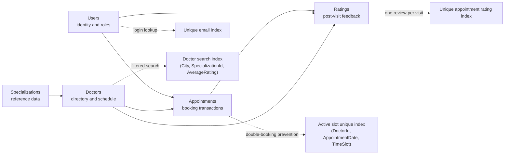

# Fracto Database Design

## Scope

This document focuses on table structure, constraints, and indexing decisions.

- For visual entity relationships and cardinality, see [ER_Diagram.md](../documentation/ER_Diagram.md).
- For API request and response contracts, see [REST_API_Design.md](../documentation/REST_API_Design.md).

## Overview

The Fracto database is designed in SQL Server to support authentication, doctor discovery, appointment booking, cancellation, and post-consultation ratings. The schema uses five core tables:

- `Users`
- `Specializations`
- `Doctors`
- `Appointments`
- `Ratings`

The structure keeps the domain normalized while still supporting efficient search and reporting.

## Schema and Index Hotspots

## Table Design

### 1. Users

Purpose: stores both patient and admin accounts.

Key columns:

- `UserId` `INT IDENTITY` primary key
- `FirstName` `NVARCHAR(100)` not null
- `LastName` `NVARCHAR(100)` not null
- `Email` `NVARCHAR(255)` not null unique
- `PasswordHash` `NVARCHAR(500)` not null
- `PhoneNumber` `NVARCHAR(20)` nullable
- `Role` `NVARCHAR(20)` not null
- `City` `NVARCHAR(100)` nullable
- `ProfileImagePath` `NVARCHAR(500)` nullable
- `IsActive` `BIT` default `1`
- `CreatedAtUtc` `DATETIME2` default `SYSUTCDATETIME()`
- `UpdatedAtUtc` `DATETIME2` nullable

Constraints:

- Unique constraint on `Email`
- Check constraint to allow only `User` or `Admin` roles

Indexes:

- Unique index on `Email`
- Nonclustered index on `Role`

### 2. Specializations

Purpose: stores reference data for doctor specialties.

Key columns:

- `SpecializationId` `INT IDENTITY` primary key
- `SpecializationName` `NVARCHAR(150)` not null unique
- `Description` `NVARCHAR(500)` nullable
- `IsActive` `BIT` default `1`

Constraints:

- Unique constraint on `SpecializationName`

Indexes:

- Unique index on `SpecializationName`

### 3. Doctors

Purpose: stores doctor profiles, working window, and search-related data.

Key columns:

- `DoctorId` `INT IDENTITY` primary key
- `FullName` `NVARCHAR(200)` not null
- `SpecializationId` `INT` not null foreign key
- `City` `NVARCHAR(100)` not null
- `ExperienceYears` `INT` default `0`
- `ConsultationFee` `DECIMAL(10,2)` default `0`
- `AverageRating` `DECIMAL(3,2)` default `0`
- `TotalReviews` `INT` default `0`
- `ConsultationStartTime` `TIME(0)` not null
- `ConsultationEndTime` `TIME(0)` not null
- `SlotDurationMinutes` `INT` default `30`
- `ProfileImagePath` `NVARCHAR(500)` nullable
- `IsActive` `BIT` default `1`
- `CreatedAtUtc` `DATETIME2` default `SYSUTCDATETIME()`
- `UpdatedAtUtc` `DATETIME2` nullable

Constraints:

- Foreign key to `Specializations`
- Check that `AverageRating` stays between `0` and `5`
- Check that `ConsultationEndTime` is later than `ConsultationStartTime`
- Check that `SlotDurationMinutes` is greater than `0`

Indexes:

- Nonclustered index on `City`
- Nonclustered index on `SpecializationId`
- Composite index on `(City, SpecializationId, AverageRating)`

### 4. Appointments

Purpose: stores booking transactions between users and doctors.

Key columns:

- `AppointmentId` `INT IDENTITY` primary key
- `UserId` `INT` not null foreign key
- `DoctorId` `INT` not null foreign key
- `AppointmentDate` `DATE` not null
- `TimeSlot` `TIME(0)` not null
- `Status` `NVARCHAR(20)` not null
- `ReasonForVisit` `NVARCHAR(500)` nullable
- `CancellationReason` `NVARCHAR(500)` nullable
- `BookedAtUtc` `DATETIME2` default `SYSUTCDATETIME()`
- `CancelledAtUtc` `DATETIME2` nullable

Constraints:

- Foreign key to `Users`
- Foreign key to `Doctors`
- Check that status is one of `Booked`, `Confirmed`, `Cancelled`, or `Completed`

Indexes:

- Composite index on `(UserId, AppointmentDate)`
- Composite index on `(DoctorId, AppointmentDate)`
- Filtered unique index on `(DoctorId, AppointmentDate, TimeSlot)` for non-cancelled appointments

### 5. Ratings

Purpose: stores post-consultation feedback.

Key columns:

- `RatingId` `INT IDENTITY` primary key
- `AppointmentId` `INT` not null foreign key
- `UserId` `INT` not null foreign key
- `DoctorId` `INT` not null foreign key
- `RatingValue` `INT` not null
- `ReviewComment` `NVARCHAR(1000)` nullable
- `CreatedAtUtc` `DATETIME2` default `SYSUTCDATETIME()`

Constraints:

- Foreign key to `Appointments`
- Foreign key to `Users`
- Foreign key to `Doctors`
- Check that `RatingValue` is between `1` and `5`

Indexes:

- Unique index on `AppointmentId` to enforce one rating per appointment
- Composite index on `(DoctorId, CreatedAtUtc)`
- Composite index on `(UserId, DoctorId)`

## Operational Relationship Notes

- `Appointments` is the central transaction table linking users and doctors for a chosen date and slot.
- `Ratings` depends on completed appointments, which is why `AppointmentId` is unique in the ratings table.
- `Doctors` depends on `Specializations`, while still carrying denormalized search data such as `AverageRating` and `TotalReviews`.
- The full PK/FK relationship view is intentionally kept in [ER_Diagram.md](../documentation/ER_Diagram.md) so this file can stay focused on schema behavior.

## Integrity and Constraint Strategy

- Unique email prevents duplicate accounts.
- Filtered unique booking index prevents slot collisions.
- Rating check constraint prevents invalid score values.
- Role and status check constraints keep domain values controlled.
- Foreign keys maintain referential integrity between dependent tables.

## Indexing Strategy

The indexing strategy is designed around the most common system operations:

- Login lookup by `Email`
- Doctor search by `City`, `SpecializationId`, and `AverageRating`
- Appointment history retrieval by `UserId`
- Slot conflict checks by `DoctorId`, `AppointmentDate`, and `TimeSlot`
- Rating display and aggregation by `DoctorId`

## Executable SQL Script

The full SQL Server script is provided in `database/Fracto_Database.sql`.
