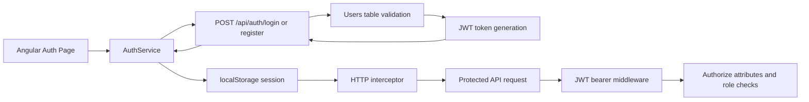
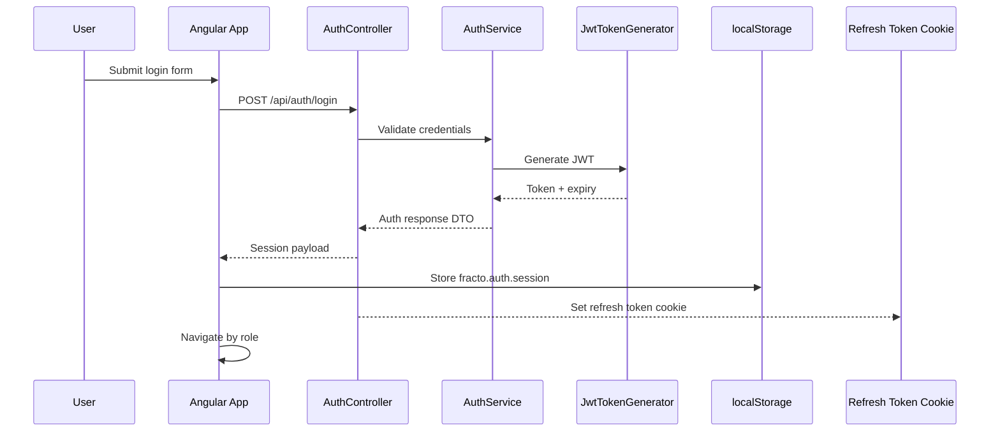

# JWT Authentication Flow

## Overview

Fracto uses JWT bearer authentication to protect user and admin API operations while keeping the frontend session flow simple. The Angular application stores the authenticated session on the client, attaches the token through an HTTP interceptor, and relies on route guards to control navigation. A refresh token is issued as an HTTP-only cookie so sessions can be renewed without exposing long-lived secrets to JavaScript.

## Scope

This file explains token generation, refresh tokens, client-side session storage, interceptor behavior, guards, and backend validation.

- For concrete auth endpoint payloads, see [REST_API_Design.md](./REST_API_Design.md).
- For the wider application architecture, see [Fracto_Project_Report.md](./Fracto_Project_Report.md).

## Current Authentication Architecture



## End-to-End Flow

### 1. Login or Registration Request

1. The user submits the login or registration form from the Angular auth page.
2. The frontend calls either `POST /api/auth/login` or `POST /api/auth/register`.
3. The backend validates the request, checks the user record, and either creates or authenticates the account.

### 2. Token Generation

After successful authentication, the backend generates a signed JWT using the configured issuer, audience, secret key, and expiry duration.

The token currently includes claims based on .NET `ClaimTypes`:

- `NameIdentifier`: user id
- `Name`: full name
- `Email`: user email
- `Role`: `User` or `Admin`

### 3. Session Payload Returned to the Frontend

The API returns an authenticated session payload (access token + user summary) and sets a refresh token cookie:

```json
{
  "message": "Login successful.",
  "token": "<jwt-token>",
  "expiresAtUtc": "2026-03-20T15:30:00Z",
  "user": {
    "userId": 2,
    "fullName": "Harsh Raj",
    "email": "user@fracto.com",
    "role": "User",
    "city": "Bengaluru",
    "profileImagePath": null
  }
}
```

### 4. Client-Side Session Storage

The Angular frontend stores the full session payload in `localStorage` under:

```text
fracto.auth.session
```

This allows the application to restore the session after a browser refresh.

### 4.1 Refresh Tokens (Session Renewal)

In addition to the access token, the backend issues a refresh token stored in an HTTP-only cookie scoped to `/api/auth`. The frontend uses `POST /api/auth/refresh` to rotate the refresh token and receive a new access token when the current one expires. The refresh token itself is never returned in the JSON payload.

This improves session handling without exposing long-lived tokens to JavaScript, and the server keeps hashed refresh tokens in the database for revocation and rotation tracking.

### 5. Attaching the Token to API Requests

The Angular auth interceptor reads the token from `AuthService` and adds this header automatically:

```text
Authorization: Bearer <jwt-token>
```

This applies to protected API requests after login or registration.

### 6. Backend Token Validation

For protected requests:

1. ASP.NET Core JWT bearer middleware reads the `Authorization` header.
2. The token signature, issuer, audience, and expiration are validated.
3. If valid, the request principal is populated with claims.
4. Controllers and helpers resolve the current user id and role from those claims.

### 7. Route Protection in the Frontend

Fracto currently uses two Angular route guards:

- `authGuard`: redirects unauthenticated users to `/login`
- `adminGuard`: redirects unauthenticated users to `/login` and non-admin users to `/doctors`

### 8. Authorization in the Backend

The API applies authorization in two layers:

- controller attributes such as `[Authorize]` and `[Authorize(Roles = "Admin")]`
- business-rule checks inside services, for example ensuring users can only cancel or rate their own appointments

## Authentication Sequence



## Security Notes

- passwords are hashed with BCrypt before being stored
- tokens are signed with a symmetric secret key from configuration
- token expiry is enforced with zero clock skew
- refresh tokens are stored in HTTP-only cookies and rotated on refresh
- admin-only endpoints depend on role claims
- CORS is restricted to configured frontend origins
- centralized exception handling avoids leaking internal stack traces in API responses

## Middleware and Configuration Points

Important implementation areas in the codebase:

- `Configuration/JwtSettings.cs`
- `Helpers/JwtTokenGenerator.cs`
- `Program.cs` authentication and authorization setup
- `core/services/auth.service.ts`
- `core/interceptors/auth.interceptor.ts`
- `core/guards/auth.guard.ts`
- `core/guards/admin.guard.ts`

## Related Documentation

- [REST_API_Design.md](./REST_API_Design.md)
- [Fracto_Project_Report.md](./Fracto_Project_Report.md)
