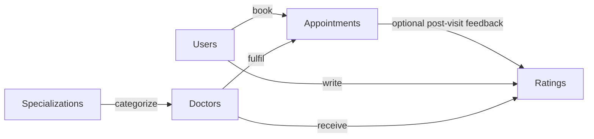

# Fracto ER Diagram

## Detailed Mermaid ER Diagram

```mermaid
erDiagram
    USERS ||--o{ APPOINTMENTS : books
    DOCTORS ||--o{ APPOINTMENTS : receives
    SPECIALIZATIONS ||--o{ DOCTORS : classifies
    USERS ||--o{ RATINGS : writes
    DOCTORS ||--o{ RATINGS : receives
    APPOINTMENTS ||--o| RATINGS : may_generate

    USERS {
        int UserId PK
        string FirstName
        string LastName
        string Email UK
        string PasswordHash
        string PhoneNumber
        string Role
        string City
        string ProfileImagePath
        bool IsActive
        datetime CreatedAtUtc
        datetime UpdatedAtUtc
    }

    SPECIALIZATIONS {
        int SpecializationId PK
        string SpecializationName UK
        string Description
        bool IsActive
    }

    DOCTORS {
        int DoctorId PK
        int SpecializationId FK
        string FullName
        string City
        int ExperienceYears
        decimal ConsultationFee
        decimal AverageRating
        int TotalReviews
        time ConsultationStartTime
        time ConsultationEndTime
        int SlotDurationMinutes
        string ProfileImagePath
        bool IsActive
        datetime CreatedAtUtc
        datetime UpdatedAtUtc
    }

    APPOINTMENTS {
        int AppointmentId PK
        int UserId FK
        int DoctorId FK
        date AppointmentDate
        time TimeSlot
        string Status
        string ReasonForVisit
        string CancellationReason
        datetime BookedAtUtc
        datetime CancelledAtUtc
    }

    RATINGS {
        int RatingId PK
        int AppointmentId FK UK
        int UserId FK
        int DoctorId FK
        int RatingValue
        string ReviewComment
        datetime CreatedAtUtc
    }
```

## Simplified Relationship View



## Cardinality Summary

- `Users 1 -> many Appointments`: one user can book many appointments.
- `Doctors 1 -> many Appointments`: one doctor can have many appointments over time.
- `Specializations 1 -> many Doctors`: each doctor belongs to one specialization.
- `Users 1 -> many Ratings`: a user can submit ratings across different completed appointments.
- `Doctors 1 -> many Ratings`: a doctor can receive many ratings.
- `Appointments 1 -> 0..1 Ratings`: an appointment may have no rating or exactly one rating.

## Key Constraints

- `Users.Email` is unique.
- `Specializations.SpecializationName` is unique.
- `Ratings.AppointmentId` is unique, which enforces one rating per appointment.
- `Appointments` uses a filtered unique index on `(DoctorId, AppointmentDate, TimeSlot)` for active bookings to prevent double-booking.
- All foreign keys are configured with restricted deletes in the EF Core model.

## Business Meaning

This ER model supports the full booking lifecycle:

- user and admin account management
- doctor classification by specialization
- doctor search by city, specialty, and rating
- slot-based appointment booking and cancellation
- post-consultation rating and review capture
