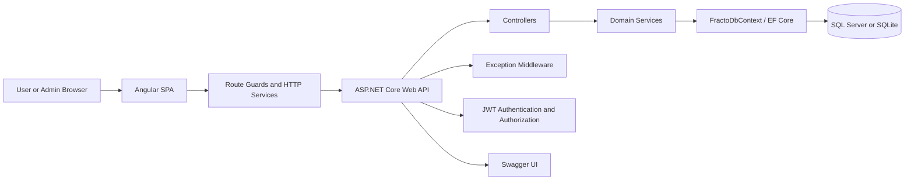
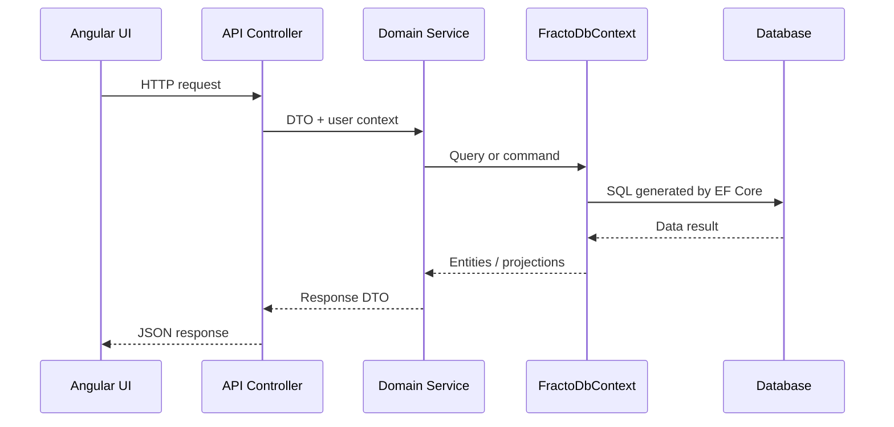
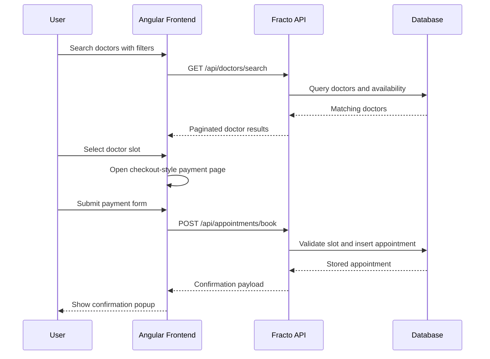

# Fracto Project Report

## Online Doctor Appointment Booking System

**Author:** Harsh Raj  
**Updated:** March 16, 2026  
**Project Type:** Full-stack capstone application

## Abstract

Fracto is a role-based doctor appointment booking platform built with Angular and ASP.NET Core Web API. The system allows patients to register, authenticate, discover doctors by city, specialization, and rating, select an available slot, complete a checkout-style payment step, and manage their appointments from a single interface. Administrators can manage doctors, monitor appointment activity, and control user access from a dedicated admin console.

This report focuses on architecture, domain design, workflows, security, and testing. For local setup, run instructions, demo credentials, and repository layout, see [README.md](../README.md).

## Problem Statement

Traditional appointment booking often depends on phone calls, manual registers, or disconnected systems. That creates several recurring issues:

- patients do not have a clear view of doctor availability
- scheduling conflicts can lead to double-booking
- doctor discovery is weak without filters like city, specialty, and rating
- cancellations and status changes are difficult to track consistently
- administrators lack a centralized operational dashboard

Fracto addresses these problems by centralizing doctor discovery, slot-based scheduling, appointment tracking, and post-consultation ratings in one web application.

## Project Goals

- provide a simple digital flow for doctor search and appointment booking
- prevent slot collisions through backend validation and constrained data storage
- support both patient and admin roles in the same platform
- expose clean REST APIs for authentication, booking, doctor management, and ratings
- keep the architecture modular enough for future payment, notification, and mobile extensions

## Solution Scope

### Primary Actors

| Actor | Main Capabilities |
| --- | --- |
| Patient / User | Register, log in, search doctors, select slots, confirm booking, cancel appointments, submit ratings |
| Admin | Manage doctor records, review appointments, update statuses, activate or deactivate users |

### Delivered Application Modules

| Area | Current Implementation |
| --- | --- |
| Authentication | Login and registration flow with JWT session handling |
| Doctor Discovery | Search by city, specialization, rating, and appointment date |
| Booking | Slot selection followed by a checkout-style payment page and appointment creation |
| Appointment Management | View appointments, filter by status, cancel active bookings |
| Ratings | Submit feedback only for completed appointments |
| Administration | Manage doctors, users, and appointment statuses |
| API Testing | Swagger UI enabled for backend exploration and secure endpoint testing |

## System Architecture

Fracto follows a layered architecture with a standalone Angular client, an ASP.NET Core API, domain services, and a relational data store managed through Entity Framework Core.

### Architecture Diagram

### Architectural Notes

- The frontend is implemented as a standalone Angular application with feature pages and shared services.
- The backend uses controller and service layers rather than a separate repository abstraction.
- Persistence is handled directly through `FractoDbContext` and EF Core queries.
- The database provider is configuration-driven, with SQL Server as the primary design target and SQLite supported for local flexibility.
- Cross-cutting concerns include JWT authentication, centralized exception handling, CORS, and Swagger.

## Frontend Design

The frontend is organized around route-level feature pages and service-driven API communication.

### Route Map

| Route | Purpose | Protection |
| --- | --- | --- |
| `/login` | user sign-in page | public |
| `/register` | user registration page | public |
| `/doctors` | doctor search, filters, and slot selection | authenticated |
| `/payment` | checkout-style booking confirmation form | authenticated |
| `/appointments` | appointment history, cancellation, and rating | authenticated |
| `/admin` | admin console for doctors, users, and appointments | admin only |

### Frontend Modules

| Module | Responsibility |
| --- | --- |
| `AuthPageComponent` | login and registration experience with demo account shortcuts |
| `DoctorsPageComponent` | doctor search, filter application, and slot-based booking entry |
| `PaymentPageComponent` | payment-form workflow before appointment creation |
| `AppointmentsPageComponent` | appointment history, cancellation flow, and rating submission |
| `AdminPageComponent` | consolidated admin operations across doctors, users, and appointments |

### Frontend Design Choices

- Angular signals are used for local UI state such as loading, feedback messages, and session-derived values.
- Feature pages call typed services such as `AuthService`, `DoctorService`, `AppointmentService`, and `RatingService`.
- Route guards enforce authentication and role-based access before navigation.
- The current UI deliberately uses a clean card-based layout with booking actions visible close to the relevant doctor records.

## Backend Design

The backend exposes REST endpoints through controllers and keeps business rules inside dedicated service classes.

### Backend Module Summary

| Layer | Key Elements |
| --- | --- |
| Controllers | `AuthController`, `DoctorsController`, `AppointmentsController`, `RatingsController`, `SpecializationsController`, `UsersController` |
| Services | `AuthService`, `DoctorService`, `AppointmentService`, `RatingService`, `SpecializationService`, `UserService`, `FileStorageService` |
| Persistence | `FractoDbContext` with EF Core relationships, indexes, and constraints |
| Security | JWT bearer authentication, role checks, password hashing with BCrypt |
| API Tooling | Swagger/OpenAPI with bearer token support |

### Request Handling Flow

### Important Backend Behaviors

- authentication returns a JWT plus a user summary payload
- doctor search supports city, specialization, minimum rating, and appointment date filters
- appointment booking validates date, consultation window, slot alignment, and active slot collisions
- ratings are allowed only for the appointment owner and only when the appointment is completed
- admin-only operations include doctor management, appointment status updates, and user activation changes

## Data Model

The system is centered on five core entities:

| Entity | Purpose |
| --- | --- |
| `Users` | stores patient and admin accounts |
| `Specializations` | stores doctor specialty reference data |
| `Doctors` | stores searchable doctor profiles and consultation schedules |
| `Appointments` | stores slot-based booking transactions and status history |
| `Ratings` | stores post-consultation feedback linked to appointments |

### Relationship Highlights

- one user can create many appointments
- one doctor can receive many appointments
- one specialization can classify many doctors
- one user can create many ratings
- one doctor can receive many ratings
- one appointment can have zero or one rating

For the full entity relationship diagram, see [ER_Diagram.md](./ER_Diagram.md).  
For schema details and constraints, see [Database_Design.md](../database/Database_Design.md).

## API Design Summary

Fracto follows REST-style API design with JSON request and response bodies.

| Module | Example Endpoints |
| --- | --- |
| Authentication | `POST /api/auth/register`, `POST /api/auth/login`, `GET /api/auth/me` |
| Doctors | `GET /api/doctors`, `GET /api/doctors/search`, `POST /api/doctors`, `PUT /api/doctors/{id}`, `DELETE /api/doctors/{id}` |
| Appointments | `GET /api/appointments`, `POST /api/appointments/book`, `DELETE /api/appointments/{id}`, `PUT /api/appointments/{id}/status` |
| Ratings | `POST /api/ratings`, `GET /api/doctors/{id}/ratings` |
| Reference Data | `GET /api/specializations` |
| Admin / Users | `GET /api/users`, user status management endpoints |

Detailed request and response examples are documented in [REST_API_Design.md](./REST_API_Design.md).

## Core Workflow: Booking a Consultation

Booking is the most important user journey in the application. The implemented flow is:

### Workflow Notes

- the payment step is currently a simulated checkout UI, not a live payment gateway integration
- appointment creation happens only after the payment form is submitted successfully
- slot uniqueness is protected by both service validation and a filtered database index

## Security and Reliability

### Security Controls

- passwords are hashed with BCrypt before storage
- JWT bearer authentication protects user and admin routes
- admin functionality is restricted through role-based authorization
- malformed requests are handled through centralized exception middleware
- CORS is explicitly configured for trusted frontend origins

### Data Integrity Controls

- unique email addresses prevent duplicate accounts
- appointment slot conflicts are blocked at service and database levels
- rating submission is limited to completed appointments and one rating per appointment
- foreign keys preserve consistency between users, doctors, appointments, and ratings

For authentication-specific flow details, see [JWT_Authentication_Flow.md](./JWT_Authentication_Flow.md).

## Testing Strategy

Testing in Fracto combines automated tests with API-level validation.

### Current Automated Test Coverage

| Area | Current Coverage |
| --- | --- |
| Frontend | app shell smoke tests, auth service session tests, auth guard navigation tests |
| Backend | service tests for doctor search, slot availability, doctor validation, doctor creation mapping, and specialization ordering |

### Manual Verification

- Swagger is enabled to test registration, login, and protected endpoints
- the Angular UI supports full-path verification of login, doctor search, payment, booking, cancellation, and rating workflows
- admin flows can be verified with the seeded admin account

## Supporting Documentation Map

To avoid duplication, the project documentation is intentionally split by purpose:

| Document | Purpose |
| --- | --- |
| [README.md](../README.md) | setup, run instructions, demo accounts, repository orientation |
| [ER_Diagram.md](./ER_Diagram.md) | entity relationships and database cardinality |
| [REST_API_Design.md](./REST_API_Design.md) | endpoint contracts and request-response examples |
| [JWT_Authentication_Flow.md](./JWT_Authentication_Flow.md) | token lifecycle and authorization flow |
| [Database_Design.md](../database/Database_Design.md) | schema and indexing details |

## Future Enhancements

- real payment gateway integration
- notifications for booking confirmations and reminders
- calendar sync support
- richer user profile and image upload UI
- deeper test coverage for controllers and end-to-end scenarios
- mobile-friendly extension or dedicated mobile client

## Conclusion

Fracto demonstrates a practical full-stack solution for digital appointment booking with clear role separation, strong domain modeling, and a user flow that moves cleanly from authentication to discovery, booking, and follow-up. The current implementation is already suitable for capstone presentation, and the surrounding documentation is now separated by responsibility so the report can focus on design quality rather than repeating setup instructions.
